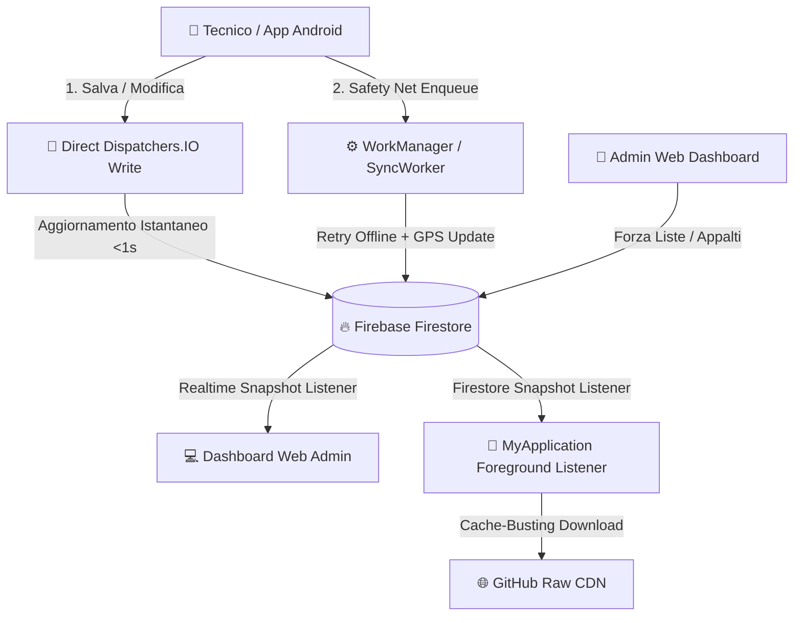

<div align="center">

# 📱 Technicalwork Materiali

**Un'applicazione Android moderna, performante e reattiva per la gestione dei materiali di cantiere, tracciamento inventario, navigazione PFS e scambi materiali in tempo reale tra tecnici.**

[-3DDC84?style=for-the-badge&logo=android&logoColor=white)](https://developer.android.com)
[](https://kotlinlang.org/)
[](https://firebase.google.com/)
[](https://m3.material.io/)
[](https://github.com/gmaclol/Technicalwork-Materiali)

---

</div>

## 🌟 Funzionalità Principali

### 📦 Gestione Materiali & Appalti (Excel Native)
- **Lettura e Scrittura Excel SAF**: Gestione nativa del formato `.xlsx` con Apache POI ad alte prestazioni.
- **Merge Intelligente con Liste Aziendali**: Integrazione automatica con i cataloghi master di ciascun appalto (es. *Elecnor*, *Sertori*, *Sirti*).
- **Separatori Dinamici & Righe Custom**: Organizzazione visiva delle sezioni con supporto all'aggiunta/rimozione dinamica di materiali extra.
- **Undo / History Parlante**: Cronologia fino a 20 snapshot con raggruppamento temporale (*Oggi, Ieri, passati*) e confronto visivo dei valori modificati.
- **Condivisione Istantanea**: Export formattato per WhatsApp, Email e gestionali aziendali.

### 🔄 Scambio Materiali via QR Code
- **Scansione & Generazione QR Code**: Generazione istantanea di codice QR per avviare uno scambio tra colleghi sul cantiere.
- **Paniere Dinamico Libere / Sparate**: Distinzione automatica delle quantità libere rispetto a quelle sparate (`StockParser`).
- **Sincronizzazione Remota Firestore**: Aggiornamento simultaneo in tempo reale degli inventari di entrambi i tecnici senza sovrascritture o blocchi.

### 🗺️ Navigazione Geografica PFS (Punti di Flessione / Snodi)
- **Streaming Parser ultra-veloce**: Parsing ad impronta di RAM costante tramite `android.util.JsonReader` per consultare cataloghi massicci (oltre 5.800 PFS).
- **Albero Geografico Dinamico**: Navigazione gerarchica ad albero *Regione → Macrozone / Comuni → PFS*.
- **Generazione Tasti Intelligente**: Rilevamento automatico delle regioni prive di macrozone (es. *Valle d'Aosta*) per una visualizzazione pulita senza pulsanti vuoti.
- **Mappa & Navigatore GPS**: Avvio diretto del navigatore di sistema sulle coordinate del PFS selezionato.
- **Segnalazione PFS Mancanti**: Coda offline per inviare segnalazioni e correzioni direttamente al database centralizzato.

### ⚡ Dashboard & Sync in Tempo Reale
- **Architettura Sync Ibrida**: Scritture istantanee *best-effort* su Firestore affiancate dalla rete di sicurezza `WorkManager` in background.
- **Cache-Busting CDN GitHub**: Aggiornamenti automatici in meno di un secondo per configurazioni remote e liste materiali aziendali (`?t=timestamp`).
- **Telemetria Senza Permessi Bloccanti**: Tracciamento intelligente dello stato di presenza, versione app, batteria e GPS con caching SharedPreferences per minimizzare l'uso della rete.
- **Design Cyberpunk Dark Mode**: Interfaccia utente scura coerente con lo stile moderno della Dashboard Web.

---

## 🏗️ Architettura del Flusso Dati (Hybrid Sync)



---

## 📴 Architettura Offline-First

L'applicazione è progettata per operare in ambienti di cantiere isolati o con scarsa copertura di rete:

- **`SyncQueue`**: Se il dispositivo è offline durante il salvataggio o lo scambio, le variazioni vengono serializzate localmente in SharedPreferences e sincronizzate automaticamente al primo ripristino della connettività.
- **`PfsSyncQueue`**: Le segnalazioni di PFS mancanti o errati vengono accodate in locale e svuotate in background via `SyncWorker`.
- **Streaming Cache Locale**: I file JSON delle regioni e le configurazioni delle aziende vengono salvati in `filesDir` locale, garantendo la consultazione immediata degli snodi anche senza connessione internet.

---

## 📲 Aggiornamenti Automatici (Auto-Update)

L'applicazione integra un sistema intelligente di auto-aggiornamento disaccoppiato da Google Play Store:
1. **Controllo Versione**: All'avvio in foreground (`MyApplication`), viene interrogata la release API di GitHub per confrontare il `versionCode` locale con quello remoto.
2. **Download in Background**: Se è disponibile una nuova versione, viene avviato il download dell'APK tramite `DownloadManager` nativo con notifica di avanzamento.
3. **Installazione Autonoma**: Al termine del download, viene invocato un `Intent.ACTION_VIEW` con `FileProvider` sicuro per procedere all'aggiornamento diretto.

---

## 🛠️ Stack Tecnologico

- **Linguaggio**: Kotlin 2.0+ (Coroutines, StateFlow, Lifecycle-aware Components)
- **Architettura UI**: Single ViewModel per schermata principale, Material3, Dynamic Drawer, RecyclerView Adapters con editing in tempo reale.
- **Database & Cloud**: Firebase Firestore KTX (Realtime listeners, dot-notation updates, snapshot history).
- **Background Jobs**: Android WorkManager 2.10 (`SyncWorker` con `ExistingWorkPolicy.REPLACE`).
- **I/O & Parsing**: Apache POI (Excel stream processing con stili e font pre-allocati), Gson, `android.util.JsonReader`.
- **Rete**: OkHttp3 gestito da client Singleton (`NetworkClient`) con supporto a GitHub Raw API.
- **QR Code & Scansione**: ZXing Core + JourneyApps Barcode Scanner integration.
- **Geolocalizzazione**: Google Play Services (`FusedLocationProviderClient`) con fallback `LocationManager`.

---

## 📁 Struttura del Progetto

```
Technicalwork-Materiali/
├── app/
│   ├── src/main/java/com/technicalwork/materiali/
│   │   ├── MainActivity.kt             # Activity principale & RecyclerView Host
│   │   ├── GeoNavActivity.kt           # Navigazione gerarchica ad albero Regioni/Comuni
│   │   ├── PfsActivity.kt              # Consultazione e ricerca streaming PFS
│   │   ├── ExchangeActivity.kt         # Gestione e logica scambio materiali QR
│   │   ├── MainViewModel.kt            # ViewModel & Gestione Undo/StateFlow
│   │   ├── FirebaseRepository.kt       # Repository cloud Firestore & Telemetria
│   │   ├── ExcelRepository.kt          # Parsing e persistenza file .xlsx
│   │   ├── MaterialMerger.kt           # Algoritmo di merge materiali/masterList
│   │   ├── SyncWorker.kt               # Worker di background per sync periodico
│   │   └── MyApplication.kt            # Lifecycle Observer globale & Push Updates
│   └── src/main/res/                   # Layouts XML, Colori semantici & Temi Dark
├── lists/                              # Liste master aziendali (.txt) & Config JSON
└── tasks/                              # Documentazione interna e registro modifiche
```

---

## 🚀 Compilazione ed Installazione

### Requisiti di Sviluppo
- **Android Studio**: Ladybug / Jellyfish (o superiore)
- **JDK**: Java 17 o Java 21
- **Gradle**: 8.x

### Build di Release
Come da convenzioni di progetto, la build ufficiale viene generata in modalità Release:

```bash
# Compilazione APK Release firmato
./gradlew :app:assembleRelease
```

L'APK compilato sarà disponibile in: `app/build/outputs/apk/release/app-release.apk`.

---

## 🛡️ Licenza e Proprietà
Progetto riservato sviluppato per il monitoraggio e la gestione dei materiali nei cantieri **Technicalwork**.

<div align="center">
  <sub>Sviluppato con ❤️ per ottimizzare il lavoro quotidiano dei tecnici sul campo.</sub>
</div>
